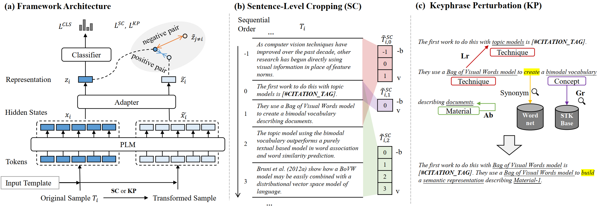

# Citss

This is the official repository of our KDD 2025 paper: "Adapting Pretrained Language Models for **Cit**ation Classification via **S**elf-**S**upervised Contrastive Learning". In this paper, we present an effective framework, Citss, that finetunes the pretrained backbone models to identify and categorize authors' intentions behind using citations in their writing. 

The preview  is available at [ArXiv](arxiv.org/abs/2505.14471v1). The acronym 'Citss' can be pronounced as 'sits'. 
- Our framework is compatible with both encoder-based PLMs and decoder-based LLMs, to embrace the benefits of enlarged pretraining. 
- Our approach introduces self-supervised contrastive learning to alleviate data scarcity.
- We propose a sentence-level cropping (SC) strategy to obtain the contrastive pairs, which enhances focus on target citations within long contexts.
- We propose a keyphrase perturbation (KP) strategy to mitigate reliance on specific keyphrases.




## 1. Preprocessing
### Split into sentences
Files in `raw_data/` are collected from the related works. File `process.ipynb` contains the original codes to split the datasets, insert citation tags, extract citance and citation context, and generate transformed samples with sentence-level cropping (SC). The processed dataset is under `data/`, so one can skip running process.ipynb.

### Extract STKs
`extract_stk.py` leverages LLMs to extract STKs in the instruction-following style. We locally load a Meta-Llama-3-70B-Instruct to obtain the response. The raw output is saved under `stk/{dataset}_raw_stk.csv` and the extracted stks are dumped as `stk/{dataset}_stk.json`, so one can skip calling the 70B LLM and extract STKs from the beginning. Please run `augment_stk.py` for each dataset to produce some intermediate files.

## 2. Finetuning

Our code to finetune is developed based on these two repos: [PET](https://github.com/timoschick/pet) and [PET for Citation Classification](https://github.com/oacore/prompt_citation_classification). The core implementation of the Citss framework is at `pet/wrapper.py: Citss`. 

### Usage
1. Install dependencies.

2. Download the backbone model to be finetuned: [Llama3-8B](https://huggingface.co/meta-llama/Meta-Llama-3-8B-Instruct) or [allenai/scibert_scivocab_uncased](https://github.com/allenai/scibert?tab=readme-ov-file). Modify `model_name_or_path` to your local path in `cli.py: finetuning`. You can use other backbones, and you will need to configure them.

3. Run cli.py . It will take some time in the first run to generate all KP transformed samples with a specific set of KP parameters, but the transformed samples will be stored for repeated runs.


## Others

1. `ifp.py` is the code to use the LLMs in an instruction-following style. 

## Cite Us
If you use the processed data or the code, please cite our work! 😄

```latex
@misc{li2025adaptingpretrainedlanguagemodels,
      title={Adapting Pretrained Language Models for Citation Classification via Self-Supervised Contrastive Learning}, 
      author={Tong Li and Jiachuan Wang and Yongqi Zhang and Shuangyin Li and Lei Chen},
      year={2025},
      eprint={2505.14471},
      archivePrefix={arXiv},
      primaryClass={cs.CL},
      url={https://arxiv.org/abs/2505.14471}, 
}
```

